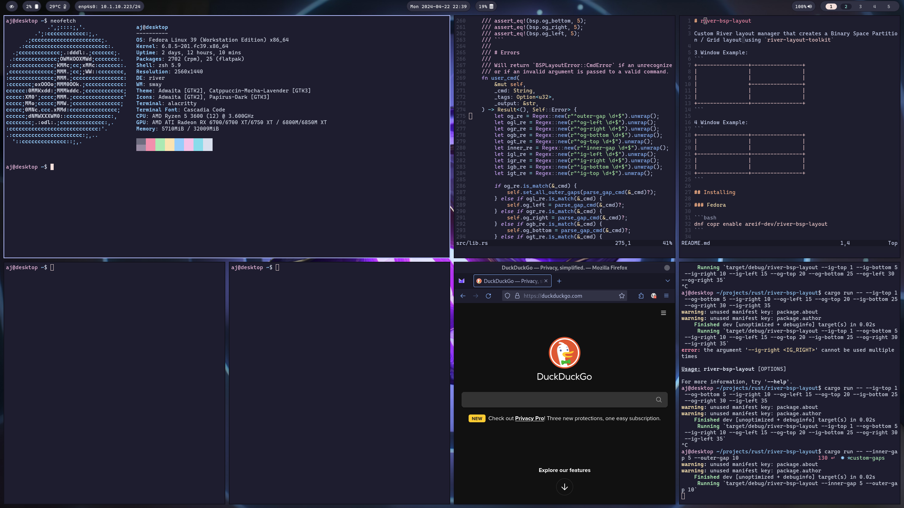

# Fedora River Bootc 

An opinionated `bootc` image of Fedora featuring the River Wayland compositor.



## Features 

* River: Wayland compositor 
* Waybar: Status bar 
* Rofi-Wayland: Dmenu compatible launcher 
* Thunar: File manager 
* Firefox: Browser
* Distrobox: Container management
* Podman: Container management 
* Cockpit: Web administration
* Zsh: Shell 
* Starship: Shell prompt

## Installing

For a complete understanding of `bootc`, please see the docs at https://containers.github.io/bootc, specifically [Understanding Bootc Install](https://containers.github.io/bootc/bootc-install.html). The following is a cursory glance at how I usually handle installing Fedora-River-Bootc. 

### Live Environment 

Boot your machine with any live iso that either allows you to install podman or ships with it out of the box. I typically use the Fedora CoreOS iso.

### Install with Root SSH Access

Please see https://containers.github.io/bootc/building/users-and-groups.html for more complete documentation. 

I enable user access on the device by using the `--root-ssh-authorized-keys` option of `bootc install to-disk`. Start by creating an `authorized_keys` file in your live environment and list out all public ssh keys you would like to have access to your root account by default. This file will have to be passed to the podman container with the `-v ./authorized_keys:/authorized_keys` option. 

This command also uses the `--wipe` switch, which will (shockingly) wipe all data on the disk, so use at your own risk. 

```bash
podman run \
    --rm \
    --privileged \
    --pid=host \
    -v /var/lib/containers:/var/lib/containers \
    -v /dev:/dev \
    -v ./authorized_keys:/authorized_keys \
    --security-opt label=type:unconfined_t \
    ghcr.io/areif-dev/fedora-river-bootc \
    bootc install to-disk \
    --root-ssh-authorized-keys /authorized_keys \
    --wipe /path/to/disk
```

Once the image finishes installing, reboot the system and ssh into the root account from a machine that you authorized previously. Now add your user account with the following: 

```bash
useradd -p "" -g wheel LOGIN
```

Now switch to that user so you can set a proper password.

```bash
su LOGIN
passwd
```

It may also be a good idea to remove the authorized_keys from the root account if you don't intend on using them further. 
